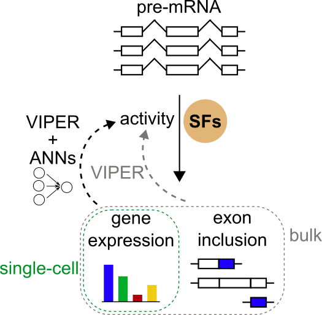

# Splicing Factor Activity Analysis

Estimate splicing factor activities from changes in exon inclusion or gene expression.



## Requirements

Install conda/mamba environment:

```shell
mamba env create -f environment.yaml
```

If you need to avoid accessing repo.anaconda.com, run this before (Based on https://github.com/mamba-org/mamba/issues/656):
```shell
conda config --add channels conda-forge
conda config --add channels bioconda
conda config --add channels pytorch
conda config --remove channels defaults
```

## Usage
### From exon inclusion signatures (DeltaPSI)

1. Check inputs:
    - exon inclusion signatures as delta PSIs ([`files/examples/signatures/Danielsson2013-EX.tsv.gz`](https://github.com/MiqG/splicing_factor_activity_analysis/tree/main/files/examples/signatures/Danielsson2013-EX.tsv.gz)):
        ```shell
        $ zcat Danielsson2013-EX.tsv.gz | head -20
        EVENT	SRR837859	SRR837861	SRR837858	SRR837860	SRR837864	SRR837862	SRR837865	SRR837863
        HsaEX0067681	0.0	0.0	0.0	6.54	0.0	0.0	5.26	8.86
        HsaEX6078702	0.0	0.0	0.0	0.0	0.0	0.0	0.0	0.0
        HsaEX0010105								
        HsaEX0010107								
        HsaEX0010102		0.0	0.0		0.0	0.0	0.0	0.0
        HsaEX6034797								
        HsaEX6034795								
        HsaEX0010108								
        HsaEX6035727	0.0	0.0	0.0	0.0				
        HsaEX0026577	-0.24	-0.24	0.24	-0.24	-0.24	0.09000000000000002	-0.24	-0.24
        HsaEX1015356		0.0	0.0					
        HsaEX1015357								
        HsaEX0027220								
        HsaEX0035417	0.0	0.0	0.0	0.0	0.0	0.0	0.0	0.0
        HsaEX0057075								
        HsaEX0057076								
        HsaEX0004223	0.0	0.0	0.0	0.0			0.0	
        HsaEX6008957	0.0	0.0	0.0	0.0	0.0	0.0	0.0	0.0
        HsaEX0004224	0.0	0.0	0.0	0.0	0.0	0.0	0.0	0.0
        ```

    - splicing factor-exon network(s) directory ([`files/sf_networks/exon_based/exon_inclusion`](https://github.com/MiqG/splicing_factor_activity_analysis/tree/main/files/sf_networks/exon_based/exon_inclusion)):
        ```shell
        .
        ├── ENASFS-metaexperiment0-delta_psi.tsv.gz
        ├── ENASFS-metaexperiment1-delta_psi.tsv.gz
        ├── ENASFS-metaexperiment2-delta_psi.tsv.gz
        ├── ENASFS-metaexperiment3-delta_psi.tsv.gz
        ├── ENCOREKD-HepG2-delta_psi.tsv.gz
        ├── ENCOREKD-K562-delta_psi.tsv.gz
        ├── ENCOREKO-HepG2-delta_psi.tsv.gz
        ├── ENCOREKO-K562-delta_psi.tsv.gz
        └── Rogalska2024-HELA_CERVIX-delta_psi.tsv.gz
        ```

2. Estimate splicing factor activity:
    ```shell
    set -eo pipefail

    conda activate sfaa
    
    SIGNATURE_FILE="files/examples/signatures/Danielsson2013-EX.tsv.gz"
    REGULONS_DIR="files/sf_networks/exon_based/exon_inclusion"
    OUTPUT_FILE="sf_activity-exon_based.tsv.gz"
    
    Rscript scripts/compute_sf_activity.R \
                --signature_file=$SIGNATURE_FILE \
                --regulons_path=$REGULONS_DIR \
                --output_file=$OUTPUT_FILE
    ```
    
3. Check output:
    - exon inclusion-based splicing factor activity estimation ([`files/examples/outputs/sf_activity-exon_based.tsv.gz`](https://github.com/MiqG/splicing_factor_activity_analysis/tree/main/files/examples/outputs/sf_activity-exon_based.tsv.gz)):
        ```shell
        $ zcat sf_activity-exon_based.tsv.gz | head -20
        regulator	SRR837859	SRR837861	SRR837858	SRR837860	SRR837864	SRR837862	SRR837865	SRR837863
        ENSG00000011304	-0.2945009981286456	0.5317888385280445	0.29188046852530575	0.7364957878452417	-0.1655552651380409	-0.421736668560809	0.7208359939294429	-0.25810633038279535
        ENSG00000013441	0.2688625695023691	-0.7506029766633112	-0.27297094083037066	-0.8708752274875845	-0.339547608578783	-0.25688671834665594	0.5218877222122946	-0.025286893528491634
        ENSG00000018610	-0.41525440770049793	1.2362494453811645	0.3917457483846899	-0.3372026043648283	2.2268639892059534	1.0983483035756687	0.22747206402727121	1.909265870800493
        ENSG00000021776	-0.4154566403148396	1.0014260884450203	0.41225615358195583	1.440602537143569	1.1124305299956319	0.5753870278817903	0.709100610532627	0.40167574120576743
        ENSG00000033030	-1.9983757498288859	1.944699235463179	1.9046998551843	1.0315946844614998	-1.1047390847931573	0.291664069123355	-1.565581992664927	-0.4203546544174533
        ENSG00000066044	0.33996257000158614	0.3483819725398736	-0.3529167920964525	0.30143945951841467	0.6654348650215004	-0.33724445644701767	0.6643368100249857	0.702464884336311
        ENSG00000067596	-0.24498404833793144	-0.09420923748587083	0.24311023680473864	-1.0608099738438541	-0.5315839249656419	0.5451185999779571	0.012932524891191618	-0.5801511106525431
        ENSG00000074356	-0.14168354790503898	-1.0568684001333668	0.14078448844797373	-0.7420347541847695	-0.8298303120018805	-0.56803704599795235	0.5882915401806021	-1.5212603700001397
        ENSG00000076770	0.5780512529890908	1.3418323962024272	-0.6421798741013419	0.2940128905663683	1.4960416600521067	0.8638214729148638	1.7247343429462716	1.0324575132717801
        ENSG00000077312	0.1416038847237429	-0.6267706559526242	-0.1947063450290113	0.030767444921563414	0.8623037748045962	0.9816895274395124	0.9492126053978569	0.7025754899026615
        ENSG00000078328	-0.30952062239082373	0.6797846434590382	0.32313092911791447	1.4077371617941947	-0.24720887484746762	0.5520615224909916	2.8870783347141336	0.2996216861115836
        ENSG00000082068	-0.49884204973834145	-0.5600894956741015	0.499684331287403	0.2127842188374254	-1.0571202201365295	-1.9647275794828354	-0.21181039306648694	-1.2432124672205227
        ENSG00000084463	-0.8410778928439935	0.5796081738840975	0.8384621443360853	1.1017093999432317	-2.430608084686955	-1.2709474099867795	-0.6698288519357192	-2.1970238887920086
        ENSG00000087087	-0.9914334023255421	-0.44594811553045227	1.1058972426125686	0.49051253455856236	0.4644347356361677	0.2822661589179386	-0.23661162300308058	-0.38143203250747165
        ENSG00000092199	0.1278280090987699	-0.33701082375684155	-0.10997265287322518	0.4280603188067288	0.26720012677975147	-0.25936923466472234	0.6451152321187927	0.06289213433598577
        ENSG00000099995	-0.4015013140314526	0.35546060200420626	0.3956002138140406	-0.3099723276008748	-0.3301882830334918	-1.006003628592083	-0.11922755386769517	-0.9063584325277887
        ENSG00000100056	-0.750993783631839	1.4311462399375756	0.739163291690383	-0.44124720304559945	-1.5649012895691274	-1.3134722434317463	-2.0115553158297512	-1.3678831125299489
        ENSG00000100410	0.04750334170077546	0.571126329057261	-0.04554628699074054	-0.18508797960557427	-0.3165569094767782	-0.3807904112990308	0.2808320322929487	-0.4838207623806543
        ENSG00000100813	0.4267882550110393	0.34397581317919196	-0.4330693077939461	-0.26823861426618734	-0.27346555266368283	-0.004426501093672316	-0.2455801007383536	0.035744801690923256
        ```

### From gene expression signatures (log2FC)

1. Check inputs:
    - gene expression signatures as log2 fold changes ([`files/examples/signatures/Hodis2022-invitro_eng_melanoc-genexpr_cpm.tsv.gz`](https://github.com/MiqG/splicing_factor_activity_analysis/tree/main/files/examples/signatures/Hodis2022-invitro_eng_melanoc-genexpr_cpm.tsv.gz)):
        ```shell
        $ zcat Hodis2022-invitro_eng_melanoc-genexpr_cpm.tsv.gz | head -20
        ENSEMBL	CB___2.CB___Engineered_melanocytes___False	C___1.C___Engineered_melanocytes___False	CBT3___4a.CBT3___Engineered_melanocytes___False	CBTP___4c.CBTP___Engineered_melanocytes___False	WT___0.WT_p15___Engineered_melanocytes___True	CBTA___4b.CBTA___Engineered_melanocytes___False	CBTPA___5b.CBTPA___Engineered_melanocytes___False	CBT_228___3a.CBT_228___Engineered_melanocytes___False	CBTP3___5a.CBTP3___Engineered_melanocytes___False
        ENSG00000225880	0.015033017024177434	0.0007221241768273594	-0.001326681835879362	-0.011634674664527105	0.0	0.02204721324651151	-0.009283984704949698	-0.004208418758251628	-0.006781458508999312
        ENSG00000230368	0.008834186692369024	0.03297009708619892	-0.012515558524019178	-0.00737275572783333	0.0	0.01974215511470876	0.024510758392757542	0.0038867919871616932	0.010059099956599538
        ENSG00000187634	0.002798945597041462	0.009254613976477623	-0.011591989392351596	-0.011591989392351596	0.0	-0.008009674115254321	-0.010200885926577018	-0.0027104746062760737	-0.010055261084698683
        ENSG00000188976	0.13776594329722058	0.10714158515781913	0.3236987218113786	0.3654918145467325	0.0	0.592650283978732	0.3720098192436482	0.2005114278968616	0.496602891321664
        ENSG00000187961	0.016761721059070943	0.006010821820807047	0.01560345263233142	-0.003465888187115393	0.0	0.016571518810484444	7.62626185643045e-05	0.01336850419161923	0.0241095115315716
        ENSG00000187583	0.012462950927146502	0.004226873714600576	0.005237597529406403	0.0	0.0	0.00950953057642106	0.0037464302831494664	0.007652106537371826	0.002438727151771623
        ENSG00000187642	0.0019214469863386772	0.0	0.0	0.0017357811780067682	0.0	0.01595962014623427	0.003873845438902243	0.0	0.0
        ENSG00000188290	0.1726936190466145	0.11906026740919991	0.10628602155165805	-0.013281331422035789	0.0	0.5054176071205095	-0.013034258899833541	0.11958176445836867	-0.013954462577949266
        ENSG00000187608	3.9355293936638462	1.2539709571985755	0.3934003049562114	0.08977045613573087	0.0	0.056795026007090854	0.11685303471019193	0.4375378837545197	-0.0526845479583668
        ENSG00000188157	0.2768919059824029	0.1334101688954991	0.001273020433597838	-0.02183782742970694	0.0	-0.003971120286696453	-0.006565343449415555	0.010188503539492813	-0.02097559643474098
        ENSG00000131591	0.011826913712432066	0.022964951608294704	0.030307165261759736	0.05605010960949637	0.0	0.060085945062967785	0.0002753475635975944	0.06027819206549438	0.02641095620357216
        ENSG00000186827	0.0	0.0	0.0	0.00522914112192143	0.0	0.0	0.008402024270541358	0.0	0.0021415190929118546
        ENSG00000078808	0.22886353756891675	0.03980294295982212	0.10106149825727395	0.14342223832806789	0.0	0.16374807477575892	0.17323302402954566	0.15944619743193633	0.14818605990692446
        ENSG00000176022	0.2343445620455089	0.032236766830964936	0.34769932607719967	0.33518904318106024	0.0	0.2672363404592806	0.23755347219194178	0.24197072064473457	0.2604265658287187
        ENSG00000184163	0.012473770464169599	0.008931956054040008	0.007478495275873173	0.00950289322168304	0.0	0.006084775557361288	0.0007901391070591966	0.019941281121856662	0.006966674915650881
        ENSG00000160087	-0.0003019777083455022	0.02237642953069996	0.24904421070382243	0.164309243907917	0.0	0.5279741975062573	0.20692856018743	0.15406223362959126	0.3004978545622379
        ENSG00000230415	0.00197443983313287	0.0	0.0	0.0	0.0	0.0	0.0	0.002227499397856332	0.0019886204382837964
        ENSG00000162572	0.005252275446532034	0.0028829882561829012	0.001765970373836067	0.008701866680255797	0.0	0.0024442161291655788	0.009206776740800317	-0.00030577908938497376	-0.0024344249592753125
        ENSG00000131584	0.02622141315067883	-0.027181458058897212	0.044197056319507655	-0.001393788362747117	0.0	0.010157462257172678	-0.03142404756322281	0.003767481978802223	-0.028600569662224573
        ```

    - splicing factor-gene network(s) directory ([`files/sf_networks/gene_based/bulkgenexpr`](https://github.com/MiqG/splicing_factor_activity_analysis/tree/main/files/sf_networks/gene_based/bulkgenexpr)):
        ```shell
        .
        ├── ENASFS-metaexperiment0-log2fc_genexpr.tsv.gz
        ├── ENASFS-metaexperiment1-log2fc_genexpr.tsv.gz
        ├── ENASFS-metaexperiment2-log2fc_genexpr.tsv.gz
        ├── ENASFS-metaexperiment3-log2fc_genexpr.tsv.gz
        ├── ENCOREKD-benchmark-log2fc_genexpr.tsv.gz
        ├── ENCOREKO-benchmark-log2fc_genexpr.tsv.gz
        └── Rogalska2024-HELA_CERVIX-log2fc_genexpr.tsv.gz
        ```

    - adjustment model for gene-baed estimation of splicing factor activity ([`files/adj_models/gene_based/bulkgenexpr`](https://github.com/MiqG/splicing_factor_activity_analysis/tree/main/files/adj_models/gene_based/bulkgenexpr)): 
        ```shell
        .
        ├── input_regulators.tsv.gz
        ├── output_regulators.tsv.gz
        ├── weights-0.pth
        ├── weights-1.pth
        ├── weights-2.pth
        ├── weights-3.pth
        └── weights-4.pth
        ```

2. Estimate splicing factor activity:
    ```shell
    set -eo pipefail
    
    conda activate sfaa

    SIGNATURE_FILE="files/examples/signatures/Hodis2022-invitro_eng_melanoc-genexpr_cpm.tsv.gz"
    REGULONS_DIR="files/sf_networks/gene_based/bulkgenexpr"
    ADJ_MODELS_DIR="files/adj_models/gene_based/bulkgenexpr"
    OUTPUT_FILE="sf_activity-gene_based.tsv.gz"
    TMP_DIR="."
    
    # estimate gene-based activity
    Rscript scripts/compute_sf_activity.R \
                --signature_file=$SIGNATURE_FILE \
                --regulons_path=$REGULONS_DIR \
                --output_file=$TMP_DIR/unadjusted_gene_based_activity.tsv.gz
                
    # adjust gene-based activity
    python scripts/adjust_genexpr_sf_activity.py \
                --activity_file=$TMP_DIR/unadjusted_gene_based_activity.tsv.gz \
                --models_dir=$ADJ_MODELS_DIR \
                --output_file=$OUTPUT_FILE
                
    # remove temporary files
    rm $TMP_DIR/unadjusted_gene_based_activity.tsv.gz
    ```
    
3. Check output:
    - exon inclusion-based splicing factor activity estimation ([`files/examples/outputs/sf_activity-gene_based.tsv.gz`](https://github.com/MiqG/splicing_factor_activity_analysis/tree/main/files/examples/outputs/sf_activity-gene_based.tsv.gz)):
        ```shell
        $ zcat sf_activity-gene_based.tsv.gz | head -20
        regulator	CB___2.CB___Engineered_melanocytes___False	C___1.C___Engineered_melanocytes___False	CBT3___4a.CBT3___Engineered_melanocytes___False	CBTP___4c.CBTP___Engineered_melanocytes___False	WT___0.WT_p15___Engineered_melanocytes___True	CBTA___4b.CBTA___Engineered_melanocytes___False	CBTPA___5b.CBTPA___Engineered_melanocytes___False	CBT_228___3a.CBT_228___Engineered_melanocytes___False	CBTP3___5a.CBTP3___Engineered_melanocytes___False
        ENSG00000011304	-2.5619812	-0.6873567	-5.7614336	-6.1377573	-0.23560369	-6.446185	-6.2103386	-4.981845	-6.291494
        ENSG00000013441	-0.81029546	0.027935266	-1.2601129	-1.1698195	0.03233688	-1.7242851	-1.2091877	-1.1822009	-1.1417059
        ENSG00000018610	-1.953867	-1.8109677	-3.5230343	-2.793755	-0.057536967	-3.6355546	-2.650043	-2.9754531	-2.7382321
        ENSG00000021776	-0.9026712	-1.1514943	-2.9488604	-0.9844084	-0.21179971	-2.6025817	-1.0045885	-1.7916485	-1.4285606
        ENSG00000033030	-0.11091795	0.5764366	-2.2167094	-2.3219535	-0.13146083	-1.9644581	-2.6006253	-1.9844013	-2.3884168
        ENSG00000048740	0.661046	0.0691013	2.5277305	2.574957	-0.0163959	3.3132126	2.6459928	1.8582073	2.6766174
        ENSG00000066044	-0.7638897	-0.9924938	-0.5899768	-0.4538037	-0.019294553	-0.3923193	-0.40118733	-0.7172458	-0.42434272
        ENSG00000067596	-0.2078166	-0.16614184	-0.16725144	0.13301364	-0.028873378	-0.4837411	0.107063435	-0.04666414	0.10874589
        ENSG00000074356	-0.36770272	0.28536826	-2.5485485	-2.4362016	-0.011574	-2.8279872	-2.595273	-2.2096856	-2.5921166
        ENSG00000076770	0.049339604	0.14517756	1.3993399	0.86162645	-0.05598103	1.5279192	0.84551907	1.0502584	0.9595855
        ENSG00000077312	-1.0035661	-0.8626834	-1.0769302	-0.78145283	-0.093930766	-1.3267044	-0.55070966	-1.2089479	-0.76207733
        ENSG00000078328	0.18972819	0.5143221	-0.012781453	0.13753746	0.10993699	-0.27493423	-0.12065865	0.28423434	0.03979977
        ENSG00000082068	-0.7671464	-0.7782125	-1.072369	-0.7177521	-0.012193809	-1.0509393	-1.0774763	-0.6266572	-0.867735
        ENSG00000084463	-1.6437004	-1.164036	-4.7779245	-3.725776	-0.0873512	-6.480075	-3.9313023	-3.8453228	-4.0688396
        ENSG00000087087	0.2064863	0.90132236	-1.0069993	-1.4393828	-0.15325274	-0.9596831	-1.9191471	-0.58800447	-1.6303818
        ENSG00000092199	-0.91319656	-0.9480963	-3.2785537	-2.0981514	-0.40822887	-4.256648	-1.6418899	-3.7351322	-2.330754
        ENSG00000099995	-1.0806401	0.062930785	-4.787934	-3.9885259	-0.18006685	-5.536992	-4.2191744	-3.9953809	-4.2545886
        ENSG00000100056	0.036314536	-1.59774	-1.7286123	-1.3022257	-0.09561183	-2.9020877	-1.8347843	0.18536457	-1.5277392
        ENSG00000100410	-0.0038380206	0.33713546	-1.3494544	-1.8726631	0.009957703	-2.4054055	-1.9078047	-1.3043528	-1.955059
        ```

## Issues
Please, report any issues here: https://github.com/MiqG/splicing_factor_activity_analysis/issues

## Citation
(TODO)
